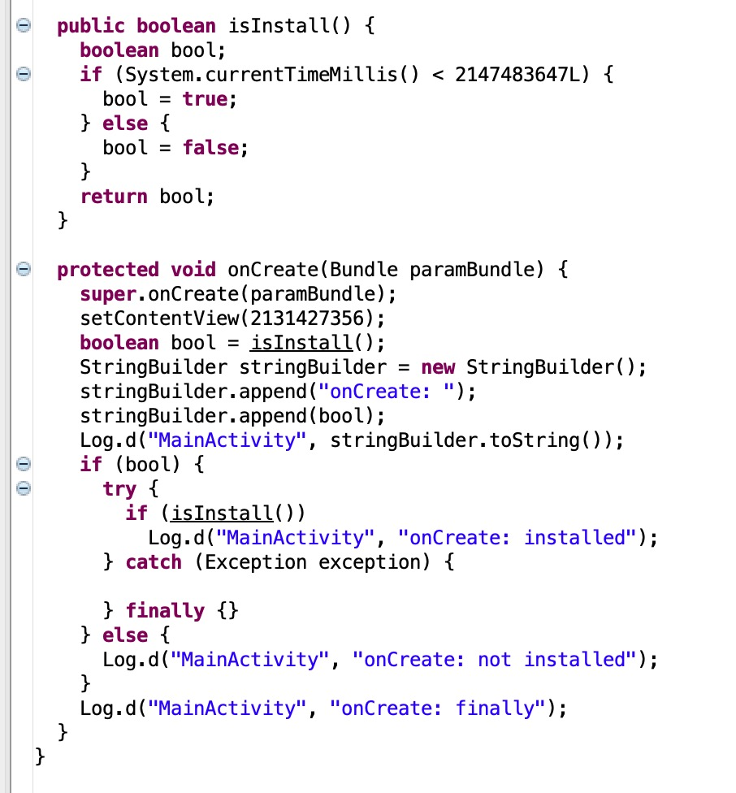
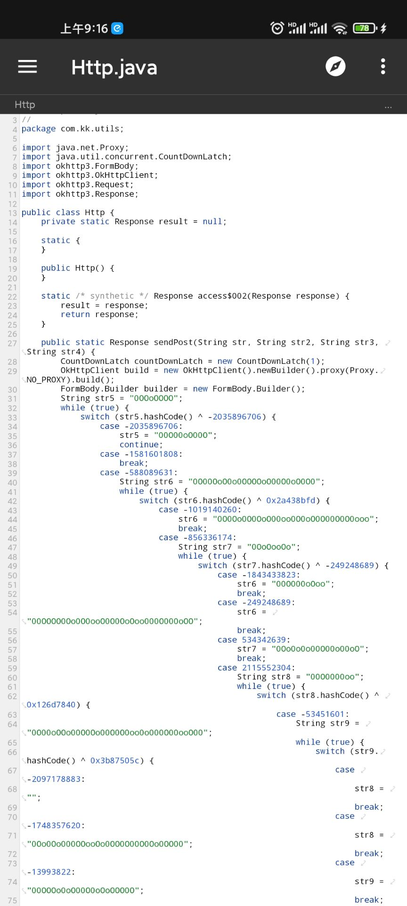
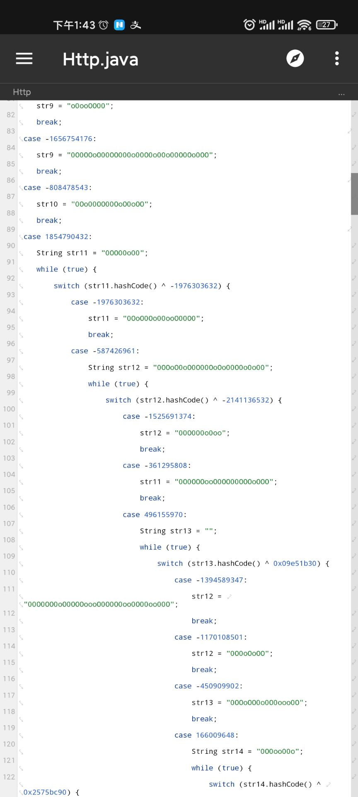

# DexFile Control Flow Flattening · BlackObfuscator


Black Obfuscator is an obfuscator for Android APK DexFile, it can help developer to protect source code by control flow flattening, and make it difficult to analyze the actual program control flow.

## Declaration
- This project was modified based on [dex2jar](https://github.com/pxb1988/dex2jar) .
- QQ Group: 390562046

## Matters Need Attention
- This project was based on dex2jar, please just obfuscate the business code, third party libraries excluded.

## Android Studio Plugin
The Android Studio Plugin version of this project has been developed, it supports obfuscating code automatically. More information about it are in [BlackObfuscator-ASPlugin](https://github.com/CodingGay/BlackObfuscator-ASPlugin)

## GUI
The graphical utility based on this project has been developed. More information about it are in [BlackObfuscator-GUI](https://github.com/CodingGay/BlackObfuscator-GUI)

## Usage
### Main#main

Parameter | Description 
---|---
-d | Obfuscation depth (The higher that number is, the more complex it is to obfuscate the code) 
-i | DexFile path 
-o | Output path 
-a | Rules file path 
-p | The packages which need to be obfuscated 

```java
    BlackObfuscatorCmd.main("d2j-black-obfuscator",
            "-d", "2",
            "-i", "/Users/milk/Documents/classes.dex",
            "-o", "/Users/milk/Documents/classes_out.dex",
            "-a", "filter.txt");
```
### Obfuscation Rules
#### Provide the classes which need to be obfuscated
```x
#it is annotation
#cn.kaicity

#package
cn.kaicity.gk.cdk.BuildConfig

#class
cn.kaicity

#blackList
!cn.kaicity.gk.cdk

#It will not obfuscate the package/class that in blackList
```

## Future plans
- More powerful obfuscation

## Preview
### Original Code

### Obfuscated Code



## References

- [dex2jar](https://github.com/pxb1988/dex2jar)

## Donate


### License

> ```
> Copyright 2021 Milk
>
> Licensed under the Apache License, Version 2.0 (the "License");
> you may not use this file except in compliance with the License.
> You may obtain a copy of the License at
>
>    http://www.apache.org/licenses/LICENSE-2.0
>
> Unless required by applicable law or agreed to in writing, software
> distributed under the License is distributed on an "AS IS" BASIS,
> WITHOUT WARRANTIES OR CONDITIONS OF ANY KIND, either express or implied.
> See the License for the specific language governing permissions and
> limitations under the License.
> ```
